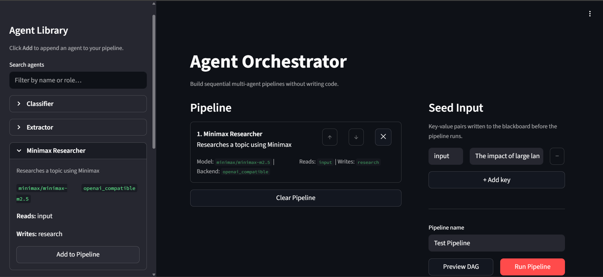
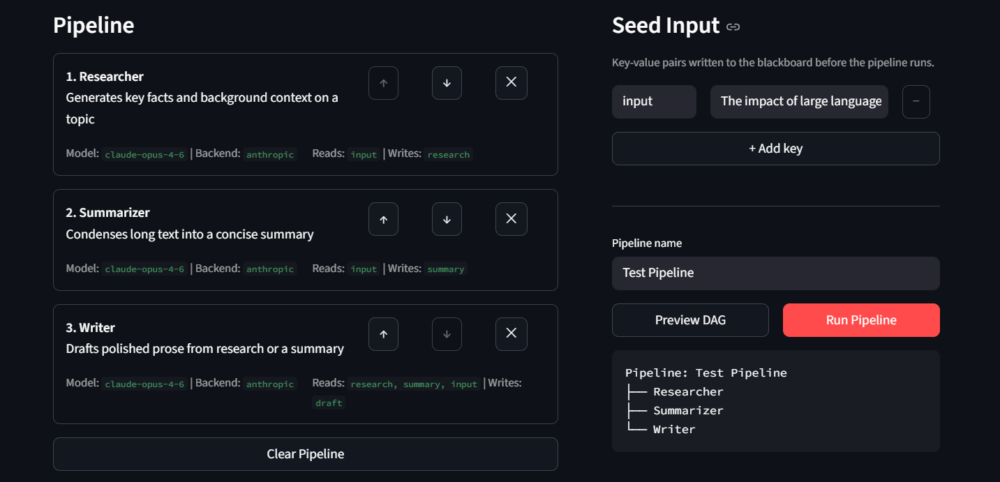
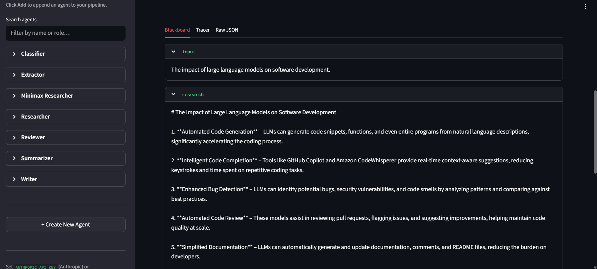
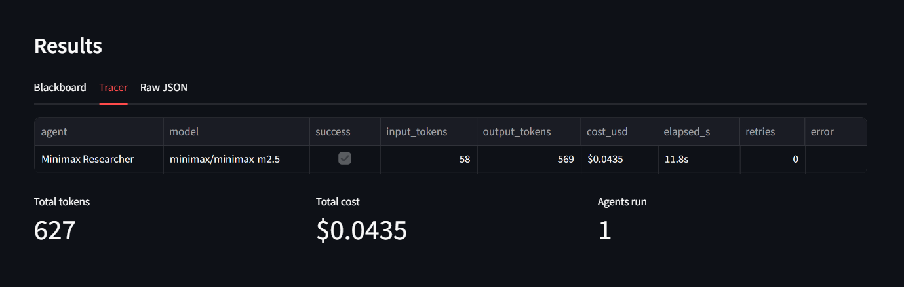

# agent-orchestrator

A lightweight Python framework for building multi-agent LLM pipelines. Define complex workflows — sequential, parallel, looping, branching — with a fluent DSL. Agents share state through a typed blackboard. Built-in execution tracing tracks tokens, cost, and latency per agent.

## Features

- **Fluent pipeline DSL** — `.then()`, `.parallel()`, `.loop()`, `.branch()`, `.fanout()`
- **Shared blackboard** — thread-safe typed key-value store agents read from and write to
- **Auto-parallelism** — agents with no overlapping dependencies run concurrently via `anyio`
- **Execution tracer** — per-agent token count, cost, and latency with a Rich summary table
- **DAG visualiser** — prints the pipeline structure as a Rich tree after each run
- **Multi-backend** — Anthropic API out of the box; any OpenAI-compatible API (Redpill, Groq, Ollama) via env vars
- **Structured output** — Pydantic-validated JSON responses with automatic fence stripping and control character sanitisation
- **Streaming truncation recovery** — automatically continues generation when a model hits `max_tokens` mid-response
- **Agent timeouts** — cancel slow agents after a configurable deadline with skip / raise / fallback actions
- **Error-based fallback** — run a substitute agent when the primary agent raises any exception
- **Schema validation feedback loop** — re-prompts the model with the exact Pydantic error on parse failure
- **Streamlit UI** — no-code pipeline builder: compose agents visually, seed the blackboard, preview the DAG, and inspect results

## Installation

```bash
pip install anthropic anyio pydantic rich pyyaml
```

For OpenAI-compatible backends (Redpill, Groq, Ollama):

```bash
pip install openai
```

For the Streamlit UI:

```bash
pip install streamlit pandas
```

## Quick start

```python
from orchestrator import Pipeline, Tracer
from orchestrator.core.agent import Agent
from orchestrator.core.blackboard import Blackboard
from pydantic import BaseModel

class SummaryOutput(BaseModel):
    summary: str
    key_points: list[str]

class SummaryAgent(Agent):
    name = "Summariser"
    system_prompt = "Summarise the given text concisely. Respond only with valid JSON."
    output_schema = SummaryOutput
    reads = ["input"]
    writes = ["summary"]

    def build_prompt(self, board: Blackboard) -> str:
        return f"Summarise this:\n\n{board.get('input', str)}"

tracer = Tracer()
board = Pipeline(name="Summarise").then(SummaryAgent()).run(
    "The orchestrator is a multi-agent framework...",
    tracer=tracer,
)
tracer.render()
print(board.get("summary"))
```

## Pipeline DSL

```python
pipeline = (
    Pipeline(name="My Workflow")
    .then(agent_a)                          # sequential
    .parallel(agent_b, agent_c)             # concurrent
    .loop(                                  # repeat until condition
        agents=[agent_d, agent_e],
        until=lambda b: b.get("done") is True,
        max_iterations=3,
    )
    .branch(                                # conditional routing
        condition=lambda b: b.get("needs_review") is True,
        if_true=review_agent,
        if_false=skip_agent,
    )
    .fanout(                                # parallel fan-out + merge
        worker=research_agent,
        inputs=[{"topic": t} for t in topics],
        output_key="research",
        gather_key="all_research",
        fanin=synthesis_agent,
    )
)

board = pipeline.run({"input": "your data"}, tracer=Tracer())
```

## Defining agents

```python
from orchestrator.core.agent import Agent
from orchestrator.core.blackboard import Blackboard
from pydantic import BaseModel

class MyOutput(BaseModel):
    result: str
    confidence: float

class MyAgent(Agent):
    name = "MyAgent"
    role = "Does something useful"
    system_prompt = "You are an expert at..."
    model = "claude-opus-4-6"           # default
    output_schema = MyOutput            # parsed + validated automatically
    reads = ["input", "context"]        # blackboard keys this agent reads
    writes = ["result"]                 # blackboard key this agent writes
    max_tokens = 8192
    use_thinking = True                 # Anthropic extended thinking

    def build_prompt(self, board: Blackboard) -> str:
        return f"Process: {board.get('input', str)}"
```

## Streamlit UI

A no-code interface for building and running pipelines without writing Python.

### Screenshots

**Agent Library & Pipeline Builder**


**DAG Preview**


**Blackboard Results**


**Tracer — Token & Cost Summary**


```bash
# Set credentials first
export OPENAI_COMPAT_BASE_URL="https://api.red-pill.ai/v1"
export OPENAI_COMPAT_API_KEY="sk-rp-..."
# or
export ANTHROPIC_API_KEY="sk-ant-..."

streamlit run ui/app.py
```

Open **http://localhost:8501** in your browser.

### What you can do

- **Agent Library (sidebar)** — browse the built-in agents (Summarizer, Researcher, Writer, Reviewer, Classifier, Extractor), filter by name or role, and add them to your pipeline with one click
- **Create New Agent** — define a custom agent through a form; saved as a YAML file in `ui/agents/` and available immediately
- **Pipeline Builder** — reorder or remove steps with ↑ / ↓ / ✕ controls
- **Seed Input** — set initial blackboard key-value pairs before the run
- **Preview DAG** — renders the pipeline structure inline without executing it
- **Run Pipeline** — executes the pipeline; streaming output goes to the terminal
- **Results tabs** — inspect the final blackboard state per key, view a tracer table (tokens / cost / latency), or export raw JSON

### Agent YAML format

Agents are defined in `ui/agents/*.yaml`:

```yaml
name: MyAgent
role: One-line description
model: minimax/minimax-m2.5
backend: openai_compatible   # or anthropic
base_url: ""                 # falls back to OPENAI_COMPAT_BASE_URL env var
system_prompt: |
  You are a helpful assistant...
reads:
  - input
writes:
  - output
max_tokens: 2048
use_thinking: false
```

## Resilience features

### Streaming truncation recovery

When a model hits `max_tokens` mid-response, the agent automatically continues with a follow-up prompt and stitches the partial outputs together. Up to 2 continuations are attempted before parsing the partial result.

### Agent timeouts

```python
class SlowAgent(Agent):
    timeout_seconds = 30
    timeout_action = "skip"   # "skip" | "raise" | fallback_agent_instance
```

### Error-based fallback

```python
class PrimaryAgent(Agent):
    error_fallback = FallbackAgent()
```

If `PrimaryAgent` raises any exception, `FallbackAgent` runs in its place.

### Schema validation feedback loop

```python
class MyAgent(Agent):
    output_schema = MyPydanticModel
    max_validation_retries = 2  # re-prompts with the exact error on parse failure
```

## Backends

### Anthropic (default)

```bash
export ANTHROPIC_API_KEY="sk-ant-..."
```

### Redpill / Groq / any OpenAI-compatible API

```bash
export AGENT_BACKEND="openai_compatible"
export OPENAI_COMPAT_BASE_URL="https://api.redpill.ai/v1"
export OPENAI_COMPAT_API_KEY="sk-rp-..."
export AGENT_MODEL="minimax/minimax-m2.5"
```

No code changes needed — agents pick up the backend from env vars automatically.

### Ollama (local)

```bash
ollama pull llama3.1:8b
export AGENT_BACKEND="openai_compatible"
export OPENAI_COMPAT_BASE_URL="http://localhost:11434/v1"
export OPENAI_COMPAT_API_KEY="ollama"
export AGENT_MODEL="llama3.1:8b"
```

## Examples

| Example | Description |
|---|---|
| [ai_startup](examples/ai_startup/) | PM → Architect + Designer (parallel) → Engineer → QA loop. Builds a full-stack MVP from a one-line idea. |
| [debate](examples/debate/) | Proponent + Opponent argue a proposition across multiple rounds, then a Judge delivers a verdict. |

### Run the AI Startup example

```bash
python -m orchestrator.examples.ai_startup.main "A budgeting app for freelancers"
```

### Run the Debate example

```bash
python -m orchestrator.examples.debate.main "AI will eliminate more jobs than it creates"
```

## Architecture

```
orchestrator/
├── core/
│   ├── agent.py        # Base Agent class — streaming, truncation recovery, timeouts, fallback
│   ├── blackboard.py   # Thread-safe typed key-value store
│   ├── pipeline.py     # Fluent DSL builder + DAG preview
│   ├── executor.py     # Async DAG walker (anyio) with timeout handling
│   └── tracer.py       # Token / cost / latency tracking
├── patterns/
│   └── nodes.py        # SequentialNode, ParallelNode, LoopNode, BranchNode, FanOutNode
├── rendering/
│   └── dag.py          # Rich tree visualiser
├── ui/
│   ├── app.py          # Streamlit pipeline builder UI
│   ├── registry.py     # YAML agent loader + dynamic class builder
│   └── agents/         # Built-in agent definitions (*.yaml)
├── examples/
│   ├── ai_startup/     # Full-stack MVP generator
│   └── debate/         # Multi-round debate system
└── tests/
    └── test_enhancements.py  # Smoke tests for resilience features
```

## Tracer output

After each run the tracer prints a summary table:

```
                   Pipeline Execution Summary
┏━━━━━━━━━━━┳━━━━━━━━━┳━━━━━━━━┳━━━━━━━━━━━━┳━━━━━━━━━┳━━━━━━━━━┓
┃ Agent     ┃ Status  ┃ Tokens ┃ Cost (USD) ┃ Latency ┃ Retries ┃
┡━━━━━━━━━━━╇━━━━━━━━━╇━━━━━━━━╇━━━━━━━━━━━━╇━━━━━━━━━╇━━━━━━━━━┩
│ PM        │ ✅ Pass │    736 │    $0.0435 │   11.1s │       - │
│ Architect │ ✅ Pass │  1,696 │    $0.0955 │   19.9s │       - │
│ Designer  │ ✅ Pass │  4,002 │    $0.2790 │   62.1s │       - │
│ Engineer  │ ✅ Pass │ 21,220 │    $1.4941 │  322.4s │       - │
│ QA        │ ✅ Pass │ 20,732 │    $0.3893 │   22.4s │       - │
├───────────┼─────────┼────────┼────────────┼─────────┼─────────┤
│           │         │ 48,386 │    $2.3013 │  418.0s │         │
└───────────┴─────────┴────────┴────────────┴─────────┴─────────┘
```

## License

MIT
